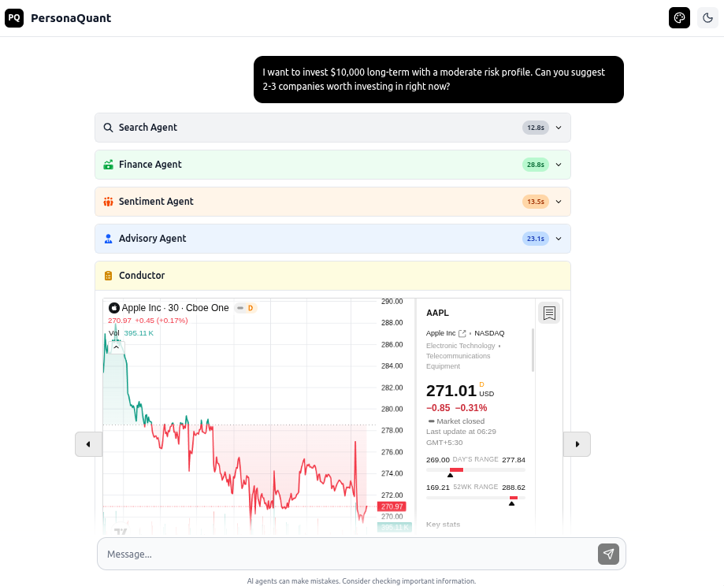
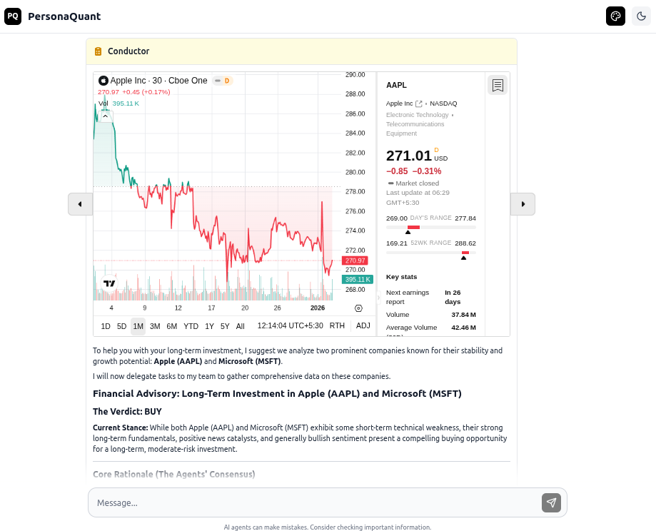
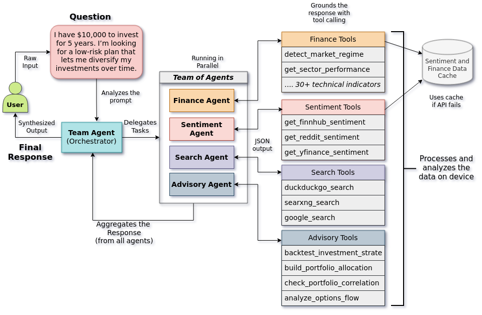

# PersonaQuant - Backend

This repository contains the backend code for PersonaQuant, a multi-agent AI system for quantitative analysis.

## Screenshot

Here are some screenshots showcasing the backend in action:

<p align="center">
  
</p>

<p align="center">
  <sub><b>All Core Agents in the System (capped for brevity)</b></sub>
</p>

<p align="center">
  
</p>

<p align="center">
  <sub><b>Final Response from Conductor Agent</b></sub>
</p>

# Architecture Overview

<p align="center">
  
</p>

<p align="center">
  <sub><b>System Architecture Diagram</b></sub>
</p>

## Prerequisites

Before you begin, ensure you have the following installed:

- Python 3.8 or higher
- uv (Python package manager)

If you don't have uv installed:

```bash
pip install uv
```

## Installation

1. Clone the repository:

```bash
git clone https://github.com/udaymehta/personaquant_backend.git
cd personaquant_backend
```

2. Install dependencies:

```bash
uv sync
```

3. Set up environment variables:

```bash
cp .env.example .env
```

## Running the Server

Start the backend server:

```bash
uvicorn main:app --reload
```

The server will now be running with hot-reload enabled for development at `http://127.0.0.1:8000`
